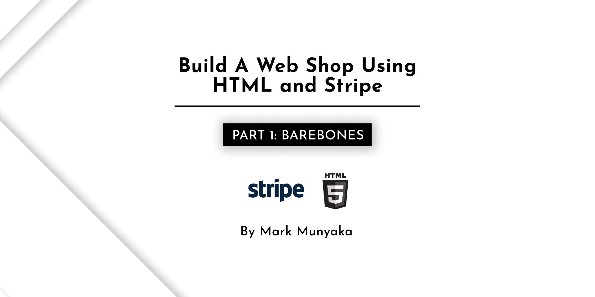
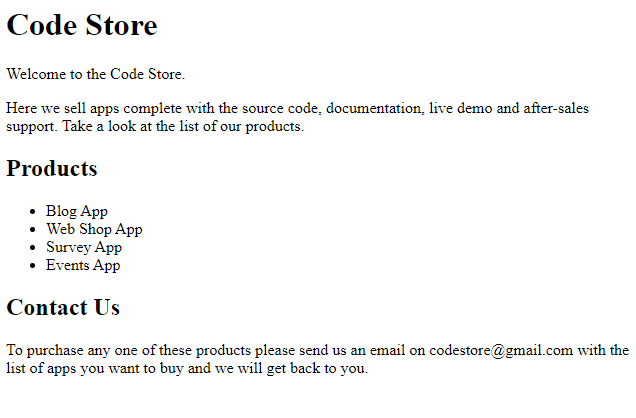

# Build an ecommerce website using HTML and Stripe



This tutorial will showcase how you can build an ecommerce website using HTML and Stripe. An ecommerce website in its simplest form is just a list of products, anything after is enhancement. 

Here is a list of prerequisites:
- Code editor like VSCode
- Browser
- VM/Server to host your site
- Stripe account
- Cloudflare account

## Create Store page

Create a folder to host your source code for this project. I'll name mine `code-store`. Create an `index.html` file and add the following code:

```html
<!DOCTYPE html>
<html lang="en">
<head>
    <meta charset="UTF-8">
    <meta name="viewport" content="width=device-width, initial-scale=1.0">
    <title>Code Store</title>
    <meta name="description" content="Welcome to the Code Store. Here we sell apps complete with the source code, documentation, live demo and after-sales support. Take a look at the list of our products.">

    <meta property="og:title" content="Code Store" />
    <meta property="og:description" content="Welcome to the Code Store. Here we sell apps complete with the source code, documentation, live demo and after-sales support. Take a look at the list of our products."
    <meta property="og:image" content="code-store.jpg" />
</head>
<body>
    <h1>Code Store</h1>
    <p>Welcome to the Code Store.</p>
    <p>Here we sell apps complete with the source code, documentation, live demo and after-sales support. Take a look at the list of our products.</p>
    <h2>Products</h2>
    <ul>
        <li>Blog App</li>
        <li>Web Shop App</li>
        <li>Survey App</li>
        <li>Events App</li>
    </ul>
    <h2>Contact Us</h2>
    <p>To purchase any one of these products please send us an email on codestore@gmail.com with the list of apps you want to buy and we will get back to you.</p>
</body>
```

## Test Store page

Open up your project folder in your terminal and run the following command to launch a local web server.

```bash
python -m http.server
```

Open the store page in your browser. You should see the following page:



## Deploy Store page

Cloudflare supports deploying any static HTML website to Cloudflare Pages.

Log in to the [Cloudflare Dashboard](https://dash.cloudflare.com/) and select your account. 

In Account Home, select **Workers & Pages** > **Create application** > **Pages**

Under **Create using direct upload**, select **Upload assets**

Give your project a name. I'll name mine `code-store`. Upload your project folder and wait for your deployment to get ready.

## Test Deployment

After you have deployed your site, you will receive a unique subdomain for your project on *.pages.dev. Cloudflare Pages will automatically rebuild your project and deploy it. 

Test your deployment by visiting your unique *.pages.dev subdomain


## Conclusion

That's it. In the next tutorial we will link the products to the Stripe dashboard for a seamless purchase.
